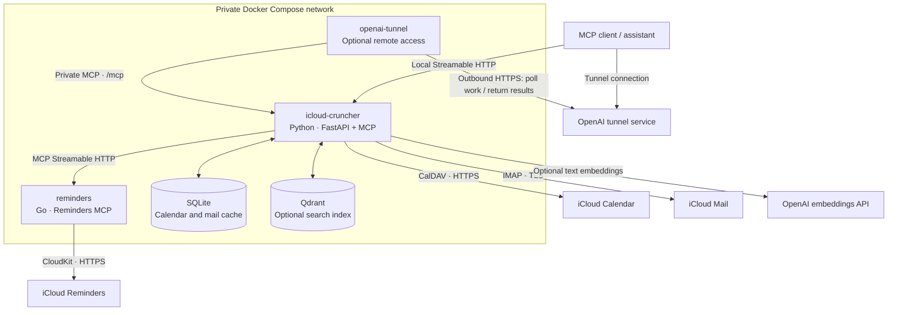

# iCloud MCP

**Calendar, mail and shared reminders — available to your assistant through MCP.**

Look up appointments, find emails and original attachments, prepare drafts,
and organise tasks, including assignments to people in shared lists. Optional
semantic search finds information inside cached emails and PDFs by meaning.

Self-host the service with Docker and connect a compatible MCP client to
one endpoint.

## What you can do

| Area | Capabilities |
| --- | --- |
| **Calendar** | List calendars, search appointments, expand recurring events into their actual occurrences, create and update events, and delete one occurrence or an entire series. |
| **Mail** | Search mailboxes, read messages without marking them read, retrieve original attachments, extract PDF/text content, prepare drafts with attachments, move messages and change read status. |
| **Reminders** | Read lists and tasks, create native sections and subtasks, arrange manual order, apply a complete target tree in one batch, change dates, notes and priorities, complete or delete tasks, and assign reminders to accepted collaborators in shared lists. |
| **Semantic search · optional** | Search cached mail bodies and PDF/text attachments by meaning, see matching excerpts, and retrieve the original message or file. |

Typical requests to a connected assistant:

- “What appointments do I have tomorrow?”
- “Find the invoice in my emails and give me the original PDF.”
- “Prepare a reply with this document attached.”
- “Create a task in our shared list and assign it to a collaborator.”

Writes change your iCloud data. MCP tool descriptions ask the client to obtain
approval before making changes; deletion also has explicit confirmation
arguments. Drafts are uploaded to iCloud Mail so you can review and send them
from your mail client.

Calendar, Mail and Reminders can be configured independently. Clients connect
to the same MCP endpoint regardless of which services are enabled.

**Read next:** [Architecture](#architecture) · [Infrastructure](#infrastructure) ·
[Docker setup](#docker-setup) ·
[Go Reminders service](#go-reminders-service) ·
[Semantic search](#semantic-search) · [Tool reference](#tool-reference) ·
[Configuration](#configuration) · [Operations](#operations) ·
[Development](#development)

## Architecture



The **Python service is the entry point** at `/mcp` and `/mcp/`. Calendar and
Mail tools call their Python adapters in worker threads because CalDAV and
IMAP are blocking. Reminders tools use an asynchronous MCP client to call the
Go service at `http://reminders:8080/mcp`.

The tunnel reaches only Python. Its container initiates an outbound connection
to OpenAI, retrieves queued requests and forwards them on the private network.
The Go hop also uses MCP Streamable HTTP: typed tools, structured results and
JSON-RPC over HTTP.
[OpenAI documents the tunnel request flow here.](https://developers.openai.com/api/docs/guides/secure-mcp-tunnels)

### Code layout

| Location | Responsibility |
| --- | --- |
| [app/main.py](app/main.py) | FastAPI application, MCP lifecycle, health checks and background workers. |
| [app/mcp_server.py](app/mcp_server.py) | Calendar/Mail/search tools and MCP result handling. |
| [app/icloud.py](app/icloud.py) | CalDAV operations and recurring-event handling. |
| [app/imap.py](app/imap.py) | IMAP searches, message reads, drafts and mailbox operations. |
| [app/reminders.py](app/reminders.py) · [app/reminders_tools.py](app/reminders_tools.py) · [app/reminders_batch.py](app/reminders_batch.py) | Asynchronous Go bridge, typed Reminders tools and declarative batch planning. |
| [app/icloud_cache.py](app/icloud_cache.py) | Persistent SQLite cache shared by Calendar and Mail. |
| [app/semantic_search.py](app/semantic_search.py) · [app/batch_embeddings.py](app/batch_embeddings.py) | Optional mail/PDF indexing, embeddings and semantic queries. |
| [app/mcp_resources.py](app/mcp_resources.py) | Private attachment snapshots served through MCP resources. |
| [docker-compose.yml](docker-compose.yml) · [Dockerfile](Dockerfile) | Service wiring and Python image build. |
| [tests/](tests/) | Fake-service tests and explicitly enabled live smoke tests. |

The Go source lives in
[Tooker/icloud-reminders-cli](https://github.com/Tooker/icloud-reminders-cli),
a fork of
[tarekbecker/icloud-reminders-cli](https://github.com/tarekbecker/icloud-reminders-cli).
Compose builds that repository directly at a fixed commit.

## Infrastructure

| Compose service | Enabled by | Purpose | Published host port |
| --- | --- | --- | --- |
| `icloud-cruncher` | Default | Common Python MCP endpoint, Calendar/Mail adapters and optional indexing. | `127.0.0.1:8080` |
| `openai-tunnel` | Default service; requires tunnel configuration | Outbound access from supported OpenAI clients to the private Python endpoint. | None |
| `reminders` | `reminders` profile | Go MCP backend for iCloud Reminders. | None |
| `qdrant` | `search` profile | Vector index for optional semantic mail/PDF search. | None |

All services communicate over the Compose network using service names.
Selecting individual services lets you run locally before configuring a
tunnel. Enabling a profile makes its services available; the corresponding
application settings enable their tools' backend connections.

### Persistent data

| Volume | Owner | Contents |
| --- | --- | --- |
| `icloud-cache` | Python | SQLite calendar summaries, mail headers, complete cached `.eml` messages and derived search state/vectors. |
| `reminders-data` | Go | Private iCloud web session, cookies, account cache and per-zone sync tokens. |
| `qdrant-storage` | Qdrant | Derived vectors and search payloads. |

Volumes survive container recreation. iCloud remains the source of truth;
Qdrant is a derived index. The Go volume contains authentication material,
and cached mail includes bodies and attachments: protect volume access and
backups as account data.

### Network and access

The Python endpoint is bound to the Docker host's loopback interface. It has
no built-in user authentication, so private networking and tunnel access form
the deployment boundary. A public HTTPS deployment would need its own
authentication and authorization design.

`REMINDERS_MCP_TOKEN` optionally authenticates the private Python-to-Go hop.
Qdrant stays private and supports its own optional API key. Host/origin checks
protect the Python MCP transport against DNS rebinding. For custom deployment
names, pass `MCP_ALLOWED_HOSTS` and `MCP_ALLOWED_ORIGINS` to Python explicitly,
for example through a Compose override's `environment` block.

## Docker setup

### 1. Configure Calendar and Mail

Requirements: Git, Docker with Compose, and iCloud account access.

```bash
git clone https://github.com/Tooker/icloudmcp.git
cd icloudmcp
cp .env.example .env
```

Edit the ignored `.env` file. For Calendar and Mail, use an Apple Account email
and an **app-specific password**:

```dotenv
ICLOUD_USERNAME=your-account@icloud.com
ICLOUD_APP_PASSWORD=xxxx-xxxx-xxxx-xxxx
ICLOUD_DEFAULT_CALENDAR=
ICLOUD_TIMEZONE=Europe/Berlin
```

Create the password using
[Apple's app-specific password instructions](https://support.apple.com/en-us/102654).
The primary Apple Account password belongs only in the separate interactive
Reminders login described below.

Mail reuses these credentials by default. If its username or password differs,
set `IMAP_USERNAME` and `IMAP_APP_PASSWORD`. The default connection is
`imap.mail.me.com:993` over TLS; use your iCloud Mail username/address.
[Apple's mail server settings](https://support.apple.com/en-us/102525)
explain the supported username formats.

### 2. Start the Python service

```bash
docker compose config --quiet
docker compose up -d --build icloud-cruncher
docker compose ps icloud-cruncher
curl http://127.0.0.1:8080/healthz
```

A local MCP client can now use **`http://127.0.0.1:8080/mcp`**.

`/healthz` returns `{"status":"ok"}` and checks application liveness.
Successful tool calls verify the configured iCloud connections.

### 3. Connect through the Secure MCP Tunnel

For supported OpenAI clients, create a tunnel in
[Platform tunnel settings](https://platform.openai.com/settings/organization/tunnels)
and associate it with the organization/workspace that will use it. Put its
runtime key and tunnel ID in `.env`:

```dotenv
CONTROL_PLANE_API_KEY=replace-with-your-tunnel-runtime-key
CONTROL_PLANE_TUNNEL_ID=tunnel_0123456789abcdef0123456789abcdef
```

```bash
docker compose up -d openai-tunnel
```

The tunnel needs outbound HTTPS to `api.openai.com:443` and private access to
`http://icloud-cruncher:8080/mcp`. In a ChatGPT developer-mode app, select
**Tunnel** and the associated tunnel. For the Responses API, use `tunnel_id`
in the MCP tool definition. See the
[official tunnel guide](https://developers.openai.com/api/docs/guides/secure-mcp-tunnels)
for access permissions and client setup.

The Compose file declares `openai-tunnel` as a default service:
`docker compose up -d` starts it too. Use the individual-service commands above
when you only want local access.

## Go Reminders service

### Enable and authenticate

Add these settings to `.env`:

```dotenv
COMPOSE_PROFILES=reminders
REMINDERS_MCP_URL=http://reminders:8080/mcp
REMINDERS_MCP_TOKEN=replace-with-a-private-random-token
REMINDERS_MCP_TIMEOUT_SECONDS=210
```

Use the same random bearer token for Python and Go; Compose passes the value
to both. It is independent of Apple credentials. Generate a value with
`openssl rand -hex 32`, for example. If search is also enabled, use
`COMPOSE_PROFILES=search,reminders`.

Build the images, stop an existing Go server and perform its interactive login:

```bash
docker compose build reminders icloud-cruncher
docker compose stop reminders
docker compose run --rm reminders auth
docker compose up -d reminders icloud-cruncher
```

Reminders uses the iCloud **web-login flow with Apple Account password and
2FA**. An app-specific password cannot replace this login. Enter credentials
and verification codes only in the administrative CLI. The running MCP server
reuses or refreshes the saved session; tool calls never prompt for passwords,
initiate 2FA or request device approval.

The Go container runs as UID `10001`. Its private session/cache are stored
under `/data` in `reminders-data`. An exclusive directory lock prevents
administrative CLI operations from running alongside the server on that data.

### Advanced Data Protection

When iCloud requires temporary web-data approval, keep Advanced Data
Protection enabled, allow web data access and approve on an online trusted
Apple device. Run:

```bash
docker compose stop reminders
docker compose run --rm reminders auth --approve-web-access --approval-timeout 3m
docker compose up -d reminders
```

The CLI reuses a valid saved login and requests temporary Reminders access.
Apple may require a separate notification for the Reminders data category.
Approval can expire and require this administrative step again.
[Apple explains web access and device approval here.](https://support.apple.com/en-us/102630)

`auth_required` indicates a missing or expired login;
`icloud_access_denied` indicates blocked web-data access. A healthy container
can still return either error: health checks report process liveness.

### Shared lists and assignment

The backend reads both owned lists and lists shared by other people. Reads
include `assignee_id` when a reminder has an assignment.

1. Call `list_reminder_lists` and `list_reminders` to obtain exact IDs.
2. Call `list_reminder_participants(list_id=...)` for that reminder's list.
3. Use one of its accepted collaborator IDs in `assign_reminder`.

Assignment arguments:

```json
{"id": "Reminder/EXACT-ID", "participant_id": "EXACT-PARTICIPANT-ID"}
```

To remove the assignment:

```json
{"id": "Reminder/EXACT-ID", "clear": true}
```

These options are mutually exclusive. Names and email addresses identify
people in the returned metadata; the write uses their exact participant ID.
Assigning to yourself is supported. The backend freshly checks membership,
the current user's write access and the selected participant's write access.
Private lists return `shared=false` and reject assignment.

Each record retains its original CloudKit database, zone and owner. Incoming
shared-list writes go to the corresponding shared zone. Assignment records
and the reminder link are updated atomically, with local cache changes
published only after complete confirmation.

### How the Go project is included

The build context in [docker-compose.yml](docker-compose.yml) points to
[Tooker/icloud-reminders-cli 1.1.0 at `f68c6f2`](https://github.com/Tooker/icloud-reminders-cli/commit/f68c6f24681f7b85232996e1c651b556e03f7de8):

```text
https://github.com/Tooker/icloud-reminders-cli.git#f68c6f24681f7b85232996e1c651b556e03f7de8
```

Docker fetches the pinned Git context and uses the Go project's Dockerfile.
A separate checkout or submodule is unnecessary for deployment.
See [Docker's Git build contexts](https://docs.docker.com/build/concepts/context/#git-repositories).

To upgrade, review a new backend commit, update the pin, rebuild
`reminders` and recreate the service. The first sync after the sharing upgrade
rebuilds older caches to include assignment records.

For local backend development, an adjacent checkout can be selected in `.env`:

```dotenv
REMINDERS_BUILD_CONTEXT=../icloud-reminders-cli
```

Native sections, moving, ordering and `batch_update_reminders` require a Go
backend with the structural tools, included in the published `f68c6f2` pin.
The combined local source build also supplies the write-integrity fixes and
optional keyed creation described in [the write-integrity notes](docs/reminders-write-integrity.md).
Batch discovery checks the required tools and returns
`backend_upgrade_required` before any writes when capabilities are missing.

The Python bridge preserves native MCP results, uses a fresh session for each
call, and bounds the total call to 210 seconds by default. Go serializes
account operations and has a three-minute tool deadline. Reminders outages do
not block Python startup or Calendar/Mail. Writes are never automatically
retried; inspect current data after a failed or timed-out write before trying
again.

Detailed backend setup, standalone HTTP/stdio usage and tests are documented
in the
[Go MCP guide](https://github.com/Tooker/icloud-reminders-cli/blob/f68c6f24681f7b85232996e1c651b556e03f7de8/docs/mcp.md).

<details>
<summary>Migrate an existing standalone Go session</summary>

Stop the standalone Go server first. Copy only its session into the new volume:

```bash
docker compose -f ../icloud-reminders-cli/compose.yaml stop reminders
docker compose stop reminders
docker compose run --rm --entrypoint sh \
  -v icloud-reminders-cli_reminders-data:/existing:ro reminders \
  -c 'test ! -e /data/session.json && cp -p /existing/session.json /data/session.json'
docker compose up -d reminders icloud-cruncher
```

Replace the source volume name if the standalone Compose project has a different
name. The command refuses to overwrite an existing destination session.
The next read performs a fresh sync without importing the old account cache.

</details>

## Semantic search

Enable semantic search when you want to find information by meaning inside
mail bodies and PDF/text attachments. Ordinary IMAP search remains available
without it.

Add these settings to `.env`:

```dotenv
COMPOSE_PROFILES=search
MAIL_SEARCH_ENABLED=true
OPENAI_API_KEY=replace-with-your-api-key
OPENAI_EMBEDDING_MODEL=text-embedding-3-large
OPENAI_EMBEDDING_DIMENSIONS=3072
MAIL_SEARCH_EMBEDDING_MODE=batch
```

Use `COMPOSE_PROFILES=search,reminders` if both optional services are needed.

```bash
docker compose up -d --build qdrant icloud-cruncher
```

**Data flow:** The IMAP crawler stores messages in SQLite. The indexer extracts
mail headers, body text and readable PDF/text attachment content from existing,
account-scoped snapshots. OpenAI computes embeddings; SQLite retains derived
state/vectors and Qdrant provides similarity search. Original PDF and `.eml`
files are not uploaded, but extracted text and search queries are sent to the
OpenAI API.

Background indexing uses the [OpenAI Batch API](https://developers.openai.com/api/docs/guides/batch)
with a `24h` completion window. Queries use immediate embeddings. Batch IDs,
input hashes and partial results persist across restarts; completed remote
files are cleaned up after ingestion. Set
`MAIL_SEARCH_EMBEDDING_MODE=standard` for immediate background requests.
No local GPU is required.

For example,
`semantic_search_emails(query="heating bill", source="attachment")` returns
scores, excerpts and retrieval arguments for the original message or
attachment. These references include `expected_uid_validity` so a reused
IMAP UID cannot resolve to an unrelated message.

Search covers cached snapshots, including expired snapshots until invalidated,
and can lag behind iCloud. It does not fetch extra mail or index calendars.
`email_search_index_status` reports progress and omitted/truncated source
counts; use ordinary `search_emails` when you need live mailbox coverage.
Scanned PDFs require OCR and are skipped.

## Tool reference

The endpoint advertises typed tools with read/write annotations. Operations on
an unconfigured backend return a safe configuration error;
`email_search_index_status` reports `configured=false` when search is disabled.

### Calendar

| Tool | Purpose |
| --- | --- |
| `list_calendars` | Discover calendars and their exact IDs. |
| `list_events` | Search by calendar, date range and text; return expanded occurrences. |
| `get_event` | Read an event/series master by calendar and UID. |
| `create_event` | Create a timed or all-day event. |
| `update_event` | Update supplied event fields. |
| `delete_event` | Delete an occurrence or event/series; requires `scope` and `confirm=true`. |

### Mail and search

| Tool | Purpose |
| --- | --- |
| `list_mailboxes` | Discover IMAP mailboxes. |
| `search_emails` | Search headers/text, sender, recipient, dates and unread status. |
| `get_email` | Read a message and attachment IDs without marking it read. |
| `get_email_attachment` | Return an original file, extracted text or original byte chunks. |
| `create_draft` | Upload a plain-text/HTML draft with optional attachments. |
| `update_draft` | Replace a draft and its optional attachments. |
| `mark_email_read` | Set or clear the `\Seen` flag. |
| `move_email` | Copy to another mailbox and mark the source for deletion. |
| `delete_email` | Delete a message with `confirm=true`; use a safe deletion marker when isolated expunge is unavailable. |
| `semantic_search_emails` | Search cached body/attachment text by meaning. |
| `email_search_index_status` | Inspect local indexing progress without fetching iCloud data or calling OpenAI. |

### Reminders

| Tool | Purpose |
| --- | --- |
| `list_reminder_lists` | Discover owned and incoming shared lists. |
| `list_reminders` | Read in manual section/sibling order; filter by list, parent, section, title and completion; `view=tree` nests the current page. |
| `get_reminder` | Read one reminder, its assignment, section, parent, depth and manual position. |
| `create_reminder` | Create in an existing list or native section, optionally as a subtask inheriting its parent's section. |
| `update_reminder` | Change supplied title/date/notes/priority fields. |
| `complete_reminder` | Mark complete; an already completed task performs no write. |
| `delete_reminder` | Permanently delete with `confirm=true`. |
| `sync_reminders` | Refresh the cache; `full=true` requests a full sync. |
| `list_reminder_participants` | Read accepted collaborators, available contact details and permissions. |
| `assign_reminder` | Assign/reassign by participant ID, or remove with `clear=true`. |
| `list_reminder_sections` | Discover native section headings and IDs in section order. |
| `create_reminder_section` | Create a native section heading in an existing list. |
| `move_reminder` | Indent/outdent, move into/out of sections, or place before/after a sibling; keep the subtree together. |
| `batch_update_reminders` | Preview or apply a complete tree with sections, new tasks, field changes and manual order. |
| `reorder_reminders` | Set the manual order of every sibling in a list, section or parent, including completed reminders. |

### Reminders sections, subtasks and ordering (1.1.0)

Section headings are native `ListSection` records, separate from reminders.
Discover them with `list_reminder_sections(list_id="list-id")`, create one with
`create_reminder_section(list_id="list-id", title="Planning")`, and pass its
returned `section_id` to `create_reminder` or `move_reminder`.

`list_reminders(list_id="list-id", view="tree")` adds a nested `tree` alongside
the compatible flat `reminders` array. The returned page contains only matching
reminders: a filtered or paginated-out parent is not silently added.
`parent_ref` remains authoritative, `depth` reports ancestor count, and
`section_ref`/`section_name` identify the inherited native section.
Follow `next_offset` for all results. `sort_index` is the zero-based position in
the list's manual order; filtering can leave gaps. Automatic sorting selected
in the Apple app can display a different order.

To indent an existing reminder, use `move_reminder(id="task-id",
parent_id="parent-id")`; `clear_parent=true` makes it top-level.
Use `section_id` or `clear_section=true` to change its section.
Subtasks inherit their parent's section. `before_id` and `after_id` are
mutually exclusive anchors in the target sibling group; omitting both appends
the subtree to that group. Moves stay within one list, reject cycles, and
preserve incoming shared lists' original database/owner zone.

`reorder_reminders` takes every sibling ID exactly once, in the desired order.
Read with `include_completed=true` first, including all pages. Set `parent_id`
for children or `section_id` for a top-level section; omit both for top-level
unsectioned reminders. Reordering preserves complete subtrees and other groups.

The descriptions and returned `legend` explain display symbols to the LLM:

| Symbol / value | Meaning |
| --- | --- |
| `•` / `✓` | Pending / completed. |
| indentation / `↳` | Subtask; use `parent_ref` as its identity. |
| `!` / `!!` / `!!!` | Low / medium / high priority; iCloud values `9` / `5` / `1`. |
| priority `0` | No priority. |
| `≡` | Handle for manual reordering; independent of priority. |

These symbols are presentation metadata and must not be inserted into titles.
Structure writes use fresh list metadata, current shared-list permissions and
an atomic CloudKit record request. Unknown metadata is preserved; unsupported
formats fail before record mutation. Writes are never automatically retried.

Repeated IDs in legacy manual-order metadata are read using their first
occurrence. An unsupported list does not prevent account discovery, flat
reminder reads, reads of other lists, or full sync. Affected results include
`structure_warnings` with `list_id`, `record_type`, `structure_field`,
`structure_reason`, and optional `structure_version`. Base reminder contents
and parent references remain available; `sort_index=-1` means that native
manual position is unavailable. Section filters and structure writes requiring
that metadata fail before writing. Batches reject warnings for their target
list before any mutation.

All 15 Python Reminders tools publish explicit MCP `outputSchema` contracts
defined in [app/reminders_schemas.py](app/reminders_schemas.py). Schemas describe
both success and error objects, recursive trees, warnings, native per-step MCP
results, and batch partial failures. Existing wire payloads and native content
are retained. Optional structural fields and optional success `write_status`
support older backends; additional fields support newer backends. Invalid
backend results produce a safe `backend_protocol_error`, preserving confirmed
write status or uncertainty without replaying the mutation.

Mutation errors expose `error_code`, `operation`, `request_id`, `retry_class`,
`retryable`, and `write_status`, plus safe upstream HTTP/code diagnostics when
available. `write_status` is `not_sent`, `failed`, `succeeded`, or `unknown`;
`retry_class` is `retryable_safe`, `retryable_after_read`, or `not_retryable`.
Read errors omit `write_status`. Structure diagnostics never contain raw
metadata or asset URLs. A confirmed structure write schedules durable scoped
read-backs and preserves account delta tokens instead of forcing a full sync.
Native deletion blocked by an existing `VALIDATE` reference (for example an
attachment) returns `write_status=failed`, `retry_class=not_retryable`, and
`upstream_error_code=VALIDATING_REFERENCE_ERROR`. The referencing records remain
intact; automatic dependent-record deletion is not supported.

Ordering and section metadata IDs are resolved against the exact CloudKit
record names in the same list and owner zone. New reminders use Apple's native
`Reminder/UUID` record names. Bare UUID inputs resolve to an existing native
record; malformed legacy bare records remain readable for recovery. Structural
writes to lists containing these records fail before dispatch with
`unsupported_structure`, `structure_reason=non_native_record_id`. Native clients
resolve ordering IDs to prefixed record names, so a matching JSON order alone
cannot make malformed records visible. Recovery requires an explicit migration;
the backend never renames or deletes them automatically.
Check recovery on an Apple device as well as in CloudKit and the web app.
In the SmokeTest recovery, retaining logical UUIDs while correcting record-name
prefixes left old entries hidden on an iPhone, although the web app showed them.
A newly created control group appeared on both clients; fresh logical UUIDs
then restored an affected group on the iPhone. This suggests retained local
identity/deletion state; the exact native-cache mechanism remains unconfirmed.
Identity renewal is explicit recovery only: refresh the original owner zone and
permissions, preserve text archives and metadata, and atomically replace
records with their parent references and order positions. Keep reminders with
attachments in place and update their parent references so attachment ownership
survives. Never automatically replay, rename or renew user records.
Ambiguous identities stop structural writes; missing positions report `-1`
instead of a shared synthetic index. Legacy duplicate ordering entries retain
their first position and do not get appended again under a different ID form.

The combined backend verifies `move_reminder` and `reorder_reminders` using a
fresh scoped list lookup before returning `moved`/`reordered` and
`order_verification=verified`. A differing saved order returns the MCP error
`upstream_mismatch` with `order_verification=mismatch`; an unavailable read-back
returns `write_verification_failed` with `order_verification=unavailable`.
Both retain `write_status=succeeded` for the confirmed CloudKit commit and
require inspection before retrying. The mutation is never replayed. Batch
execution stops at this step and retains all earlier confirmed results.
Verification confirms the stored CloudKit order, not rendering or completed
synchronization on an iPhone. Text documents encode native UTF-16 code-unit
lengths, including emoji surrogate pairs; title updates also advance the native
field resolution tokens while preserving unrelated clocks and extensions.
Updates refresh the original text archive and retain its CRDT replica history,
character identities and deletion tombstones. They accept gzip and native
zlib archives. Unsupported archives fail before dispatch with
`unsupported_text_document` and `structure_field=TitleDocument|NotesDocument`.
Replacing an existing archive with a freshly encoded document can discard
deletion history. A native client retaining old character identities may then
concatenate old and new titles even when CloudKit stores one correct string.
Preserving the current archive prevents further history loss but cannot recover
identities already absent from it. Recovery may require replacing the entire
title in an Apple editor that still holds the merged history, then checking
CloudKit and the device after reopening the list. Preserve the original
reminder and its attachments; do not recreate it merely to repair its text.

The authorized opt-in `tests/test_live_reminders_ordering.py` covers top-level
and child reorders, before/after/append moves, and delta/full sync. Set
`RUN_LIVE_REMINDERS_WRITE_TESTS=1` and `LIVE_REMINDERS_WRITE_LIST_ID` only for a
list where writes are authorized. It removes its own marked test reminders
and verifies that the existing contents, hierarchy and relative order remain.

### Building the paired Python 1.3.0 and Reminders 1.1.0 source checkouts

Keep this repository beside the updated `icloud-reminders-cli` checkout and run:

```bash
docker compose -f docker-compose.yml -f docker-compose.release.yml --profile reminders config --quiet
docker compose -f docker-compose.yml -f docker-compose.release.yml --profile reminders build
```

This produces `icloud-cruncher:1.3.0` and `icloud-reminders:1.1.0` locally.
The release override explicitly selects the adjacent Go source; the main
Compose file pins the published 1.1.0 backend commit. Use the same two Compose files
when starting the locally built pair. Building images does not recreate the
running services.

### Declarative Reminders batches

`batch_update_reminders` accepts the desired tree for one existing list.
`reminders` holds unsectioned top-level tasks; `sections` holds native headings
and their top-level tasks. Each task's `subtasks` array defines its children
in manual order. Existing tasks use their exact `id`; new tasks omit `id` and
require `title`. Optional `title`, `due`, `notes` and `priority` change existing
fields. Omitted fields preserve their values, completion and assignment.
New tasks may also supply a UUID `client_request_id` for keyed creation on the
combined backend. Keys must be unique within the target and are checked against
the backend schema before any writes. Preserve a key and its exact arguments
when recovering its creation; a key does not make the entire batch atomic.

Read `list_reminders` with `include_completed=true` and include **every existing
reminder exactly once**, including completed tasks. Include all existing
sections in their current order with `id` only; append new sections with
`title` and no `id`. Section renaming/reordering is unsupported. The batch never
deletes tasks, changes completion or assigns participants. Input is bounded to
500 total reminders, 100 sections and 20 task levels. Lists larger than the
reminder bound must use individual tools.

For a list with exactly two existing reminders and no existing sections:

```json
{
  "list_id": "List/EXACT-LIST-ID",
  "dry_run": true,
  "reminders": [{"id": "Reminder/EXISTING-ONE"}],
  "sections": [{
    "title": "Project",
    "reminders": [{
      "id": "Reminder/EXISTING-TWO",
      "priority": "high",
      "subtasks": [{"title": "Prepare outline", "due": "2026-10-02"}]
    }]
  }]
}
```

`dry_run=true` is the default: discovery and current data are read, the full
structure is validated, and the planned operations are returned without writes.
After approval, submit the same structure with `dry_run=false`; current data is
checked again before applying it. New section/task IDs are resolved within the
batch and returned in `ids`, keyed by their input paths.

The Python batch uses one fresh Go MCP session and one total deadline for all
steps. Its writes are **sequential, not atomic**; each backend operation retains
its native zone and permission checks. The Go service serializes individual
operations, so another client can change data between batch steps. No rollback
or automatic retry is attempted. On error, `isError=true` accompanies a
structured result containing confirmed operations and their original MCP
results, created IDs, the failed operation, and an indication that its write
may be uncertain. The failed step retains safe `write_status`, `retry_class`,
request correlation and available upstream diagnostics. Inspect current data and construct a fresh target before
retrying; replaying a batch containing new tasks can duplicate them.

### Recurring events

Calendar search windows include their start and exclude their end.
`list_events(calendar="calendar-id", start="2026-09-30", end="2026-10-01")`
returns occurrences overlapping September 30 in the configured timezone.

Recurring results contain `series_uid`, `occurrence_id` and `recurrence_id`.
The start/end are the actual occurrence times; `recurrence_id` identifies its
original slot even when moved. Copy that ID unchanged to delete one occurrence:

```json
{
  "calendar": "calendar-id",
  "uid": "series-uid",
  "scope": "occurrence",
  "recurrence_id": "2026-09-30T18:00:00+02:00",
  "confirm": true
}
```

All-day IDs use `YYYY-MM-DD`; timed IDs use complete ISO datetimes, with an
offset for zoned events and no offset for floating events. Equivalent UTC
timestamps are accepted for zoned occurrences. Missing or invalid occurrence
IDs are rejected; there is no fallback to deleting the series.

Occurrence deletion adds a timezone/type-preserving `EXDATE`, removes matching
single-occurrence overrides and preserves `RANGE=THISANDFUTURE` anchors.
Its result reports the original occurrence date
and actual affected date. Repeating deletion is safe. To delete an entire
event/series, use `scope="series"` and omit `recurrence_id`; this also applies
to nonrecurring events.

### Mail attachments and identities

IMAP UIDs are local to a mailbox. Carry the mailbox with the UID returned by
searches, and retain `expected_uid_validity` from semantic retrieval references.

Call `get_email` first to obtain attachment IDs, then call
`get_email_attachment(uid="42", mailbox="INBOX", attachment_id="1")`.

| Format | Result | Bounds |
| --- | --- | --- |
| `file` · default | Complete original binary resource plus a resource link with filename, MIME type and size. | Up to 30 MB; `offset=0`; `limit` never truncates the file. |
| `text` | Extracted PDF/text with `text_status` and pagination. | Files up to 10 MB; PDF page streams up to 5 MB. |
| `base64` | Original bytes in chunks, including larger files. | Default chunk 20,000 bytes; maximum 100,000. |

Text offsets/limits count characters; base64 offsets/limits count decoded bytes.
Follow `next_offset` while `has_more` is true. Decode each base64 chunk
separately before joining its bytes.

Native file links refer to opaque MCP snapshots served by `resources/read`.
Snapshots expire after at most 15 minutes, with bounds of 64 files and 30 MB
total; eviction or service restarts can expire them earlier. Request the file
again if a link expires. They are excluded from `resources/list` and have no
public download route. Download/preview presentation depends on the client.

## Configuration

Docker Compose reads `.env`. Local Python can use environment variables or an
optional `config.yaml`; environment values take precedence.
Both private files are ignored by Git.
See [.env.example](.env.example) and [config.example.yaml](config.example.yaml).

| Setting | Default / role |
| --- | --- |
| `ICLOUD_USERNAME` · `ICLOUD_APP_PASSWORD` | Calendar account; also the Mail fallback. |
| `ICLOUD_DEFAULT_CALENDAR` | Optional name/ID from `list_calendars`. |
| `ICLOUD_TIMEZONE` | Application default `UTC`; Compose default `Europe/Berlin`. |
| `IMAP_USERNAME` · `IMAP_APP_PASSWORD` | Optional dedicated Mail credentials. |
| `IMAP_HOST` · `IMAP_PORT` | `imap.mail.me.com` · `993`. |
| `IMAP_DEFAULT_MAILBOX` · `IMAP_DRAFTS_MAILBOX` | `INBOX` · `Drafts`. |
| `REMINDERS_MCP_URL` | Empty disables the Go connection; Compose address `http://reminders:8080/mcp`. |
| `REMINDERS_MCP_TOKEN` | Optional private bearer token shared by Python and Go. |
| `REMINDERS_MCP_TIMEOUT_SECONDS` | `210`; total bridge deadline. |
| `REMINDERS_BUILD_CONTEXT` | Pinned Git context; optional development override. |
| `COMPOSE_PROFILES` | `reminders`, `search`, or `search,reminders`. |
| `CONTROL_PLANE_API_KEY` · `CONTROL_PLANE_TUNNEL_ID` | Required when running the tunnel. |
| `TUNNEL_CLIENT_VERSION` · `QDRANT_VERSION` | Compose image defaults: `v0.0.15` · `v1.19.1`. |

Compose sets `ICLOUD_CACHE_PATH=/data/icloud-calendar-cache.sqlite3`.
Local Python defaults to `data/icloud-calendar-cache.sqlite3`.
To use a different YAML path locally, set `ICLOUD_CRUNCHER_CONFIG`.
To use YAML in Docker, add a `docker-compose.override.yml` mount:

```yaml
services:
  icloud-cruncher:
    volumes:
      - ./config.yaml:/app/config.yaml:ro
```

<details>
<summary>Cache and background-worker settings</summary>

| Setting | Default |
| --- | --- |
| `ICLOUD_CACHE_TTL_SECONDS` | `60` · event reads. |
| `ICLOUD_CALENDARS_CACHE_TTL_SECONDS` | `300` · calendar listings. |
| `ICLOUD_CACHE_REFRESH_ENABLED` | `true`. |
| `ICLOUD_CACHE_REFRESH_INTERVAL_SECONDS` | `30`; capped at half the event TTL. |
| `IMAP_EMAIL_CACHE_TTL_SECONDS` | `300` · header cache. |
| `IMAP_MAILBOX_CACHE_TTL_SECONDS` | `1800`. |
| `IMAP_EMAIL_CONTENT_TTL_SECONDS` | `86400` · full messages. |
| `IMAP_EMAIL_CACHE_DAYS` | `100` · legacy header coverage. |
| `IMAP_EMAIL_CACHE_MAX_MESSAGES` | `1000` · legacy header cap. |
| `IMAP_CONNECTION_POOL_SIZE` | `4` reusable TLS connections. |
| `IMAP_EMAIL_CACHE_CRAWL_ENABLED` | `true`. |
| `IMAP_EMAIL_CACHE_CRAWL_BATCH_SIZE` | `25`. |
| `IMAP_EMAIL_CACHE_CRAWL_INTERVAL_SECONDS` | `0.1` between batches. |
| `IMAP_EMAIL_CACHE_MAX_MESSAGE_BYTES` | `25000000`. |

Calendar polling warms the rolling default window at startup and up to eight
recent unfiltered calendar/date windows for an hour. TTL checks and foreground
fetches still apply. Writes invalidate events, and an older in-flight refresh
cannot republish invalidated entries. A TTL of zero disables fresh cache hits;
an event TTL of zero also disables polling.

Mail searches reuse immutable summaries alongside full cached messages, while
IMAP supplies current matching UIDs, flags and INTERNALDATE. Header searches
never load full-message BLOBs. The older 1000-message/100-day cache applies
only when full-message snapshots are unavailable; it does not limit live
mailbox coverage. A newest-to-oldest crawler fills full-message storage and
skips oversized messages. Mail mutations invalidate affected mailbox entries.

Cache namespaces include the protocol, server and account. UIDVALIDITY changes
prevent reusing messages under an old mailbox generation. SQLite uses WAL for
concurrent cache/index work.

</details>

<details>
<summary>Semantic-search settings</summary>

| Setting | Default |
| --- | --- |
| `MAIL_SEARCH_ENABLED` | `false`. |
| `OPENAI_EMBEDDING_MODEL` | `text-embedding-3-large`. |
| `OPENAI_EMBEDDING_DIMENSIONS` | `3072` for large; `1536` for small when unset. |
| `QDRANT_URL` | `http://qdrant:6333`; fixed in the supplied Compose environment. |
| `QDRANT_API_KEY` | Optional; shared by Python and Qdrant. |
| `QDRANT_COLLECTION_PREFIX` | `icloud-mail`. |
| `MAIL_SEARCH_EMBEDDING_MODE` | `batch`; `standard` also supported. |
| `MAIL_SEARCH_BATCH_SIZE` | `100` messages prepared per pass. |
| `MAIL_SEARCH_POLL_SECONDS` | `30`. |

`OPENAI_API_KEY` is required when search is enabled. Both large and small
embedding models are supported; dimensions can be reduced within the model's
maximum. When switching to small, also change/remove the explicit `3072`
dimension value copied into your `.env` from the example.

Index identities include the account, model, dimensions and extraction version.
Unchanged text reuses persisted embeddings. Extraction is bounded to 64 chunks,
20 attachments and 100,000 characters per body/attachment; omitted or truncated
sources are reported in index status. Invalidated sources are suppressed from
results before the worker removes their derived Qdrant points.

</details>

## Operations

### Updates and health

```bash
git pull --ff-only
docker compose build
docker compose up -d
docker compose ps
```

Run the service-specific commands from setup if the tunnel is unconfigured.
After changing `.env`, recreate affected services with `docker compose up -d`;
a rebuild is needed after code, dependency or Dockerfile changes. If only an
optionally mounted `config.yaml` changed, restart `icloud-cruncher`.

| Endpoint | Purpose |
| --- | --- |
| `GET /healthz` | Local application liveness: `{"status":"ok"}`. |
| `/mcp` · `/mcp/` | Streamable HTTP MCP transport with POST/GET/DELETE. |

Other paths return `404`. Health checks do not contact iCloud on every probe.
Go also has a private liveness endpoint at `/healthz`.

### Logs and diagnostics

Python logs request timings and `mcp_tool_start`/`mcp_tool_complete` with tool
name, outcome, duration and safe result counts. Correlated `mcp_phase` spans
include `call_id`, `span_id` and `parent_span`; durations include child spans.
Cache logs describe hits, writes and invalidations. Background workers report
aggregate progress.

Logs omit arguments, event/mail contents, participant details, credentials,
remote URLs and upstream exception text from MCP diagnostics.

| Symptom | Next step |
| --- | --- |
| Tools are visible but report “not configured” | Check the relevant account/backend settings and recreate Python after `.env` changes. |
| Reminders returns `auth_required` | Stop Go, run `reminders auth` against the same volume, then start Go again. |
| Reminders returns `icloud_access_denied` | Check iCloud web access and use the device-approval command. |
| A Reminders write times out or fails | Read the current reminder before deciding whether to retry. |
| Semantic results are missing or old | Check `email_search_index_status`, the crawler and Qdrant; use IMAP search for live coverage. |
| An attachment resource link expired | Request the attachment again through `get_email_attachment`. |

## Development

Python **3.12+** and `uv` are required for local development.

```bash
uv sync
cp config.example.yaml config.yaml
# Replace placeholder credentials, or export the equivalent environment values.
uv run uvicorn app.main:app --host 127.0.0.1 --port 8080
```

Local Python does not automatically load Compose's `.env`.
For a local process connected to a standalone Go container, use its
loopback-published address and the same configured bearer token:

```bash
REMINDERS_MCP_URL=http://127.0.0.1:8081/mcp \
  uv run uvicorn app.main:app --host 127.0.0.1 --port 8080
```

### Verification

```bash
uv run pytest
docker compose config --quiet
docker compose build
```

Normal tests use fake CalDAV/IMAP/Go services and skip real account access.
They cover recurring-event deletion, cache generations/invalidation, native
attachments, semantic indexing and the Python-to-Go MCP bridge. The Go
repository separately tests shared-zone routing, permissions and
assign/reassign/clear using simulated CloudKit responses.

To test the deployed Python → Go → iCloud read path:

```bash
RUN_LIVE_REMINDERS_TESTS=1 uv run pytest tests/test_live_reminders.py -q -s
```

The test discovers tools, reads lists and current tasks, samples one reminder
and checks participants for each list. It reports counts only and never assigns,
deletes, logs in or requests device approval.
Override the target with `LIVE_REMINDERS_MCP_URL` if needed.

For the opt-in IMAP smoke test, export credentials into the environment or use
the local YAML configuration first:

```bash
RUN_LIVE_IMAP_TESTS=1 uv run pytest tests/test_live_imap.py -q
```

VS Code tasks in [.vscode/tasks.json](.vscode/tasks.json) cover dependency
sync, local startup, tests and Compose commands.

## Current limits

- Mail drafts are prepared through IMAP; sending from this service is not implemented.
- Reminders operates on existing lists. Creating/deleting lists, inviting people,
  and clearing an existing reminder's notes or due date are not exposed.
- PDF extraction and semantic search use embedded text; OCR is not included.
- Semantic search covers cached mail and can lag behind live mailbox state.
- Native attachment previews/downloads depend on the MCP client.
- Reminders uses private iCloud web/CloudKit APIs and temporary device approval;
  Apple can change the protocol or expire access.
- Calendar, Mail and Reminders are supported; Contacts, Notes and iCloud Drive
  access are outside the current scope.
